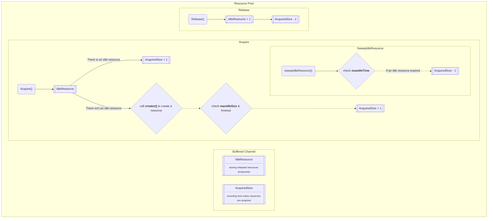

# Table of Contents
- [Description](#description)
- [Resource Pool](#resource-pool)
- [Flowchart](#flowchart)
- [Usage](#usage)
- [Todo](#todo)

## Description

Please implement a Golang generic resource pool with given "New" function and "Pool" interface.

1. Please implement NewPool <span style="color: pink">WITHOUT</span> using any package except golang build-in "fmt", "sync" and "time"
2. Please write corresponding unit tests

```go
type Pool[T any] interface {
	// This creates or returns a ready-to-use item from the resource pool 
	Acquire (context.Context) (T, error)
	// This releases an active resource back to the resource pool
	Release(T) 
	// This returns the number of idle items 
	NumIdle() int
}

// creator is a function called by the pool to create a resource
// maxIdleSize is the number of maximum idle items kept in the pool
// maxIdleTime is the maximum idle time for an idle item to be swept from the pool
func New[T any] (
	creator func(context.Context) (T, error), 
	maxIdleSize int, 
	maxIdleTime time.Duration,
) Pool[T] { 
	// please implement
}
```

## Resource pool

限制資源總量，並管理資源的增加或減少

## Flowchart



## Usage

Please refer to [example](https://github.com/uhcakip/pool-demo/tree/master/example)

## Todo

有想到但沒有實作出來的部分

- ctx.Done() 後續處理
- 閒置資源先後順序